# Dawakhana

A collaborative healthcare record management system that connects doctors and patients through a shared electronic health record platform.

## Features

* Doctor Dashboard
* Patient Directory
* Patient Profiles
* Medical Records Management
* Prescription Management
* Appointment Tracking
* Shared Patient Records Across Doctors
* Recovery Tracking
* Secure Access Gateway
* Doctor–Patient Communication Module

## Current Tech Stack

* React.js
* Vite
* JavaScript (ES6+)
* Context API
* CSS3

## Installation

```bash
git clone https://github.com/bhaktisharma07/Dawakhana.git
cd Dawakhana
npm install
npm run dev
```

## Project Goal

To provide a centralized healthcare platform where doctors can securely access patient records, manage treatments, and collaborate with other healthcare professionals while patients stay connected with their healthcare providers.

## Screenshots

### Landing Page

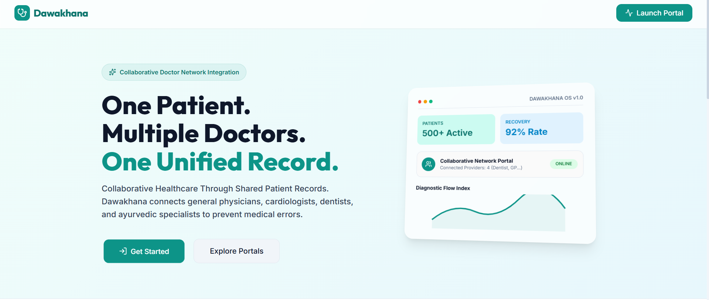

### Doctor Network Concept

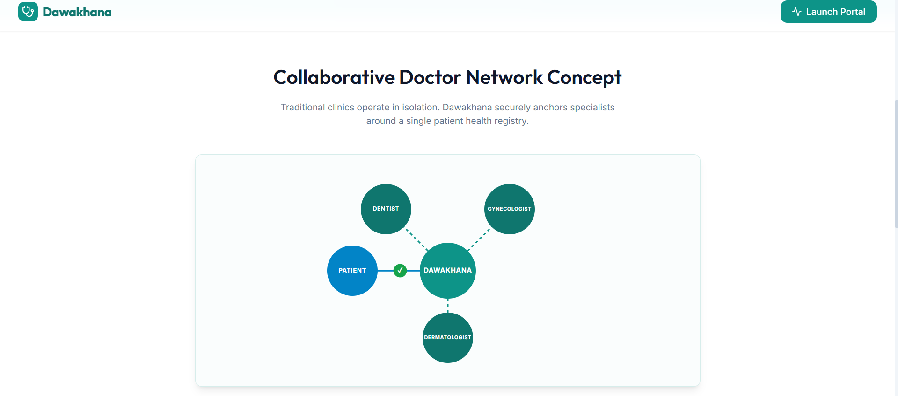

### Secure Access Gateway

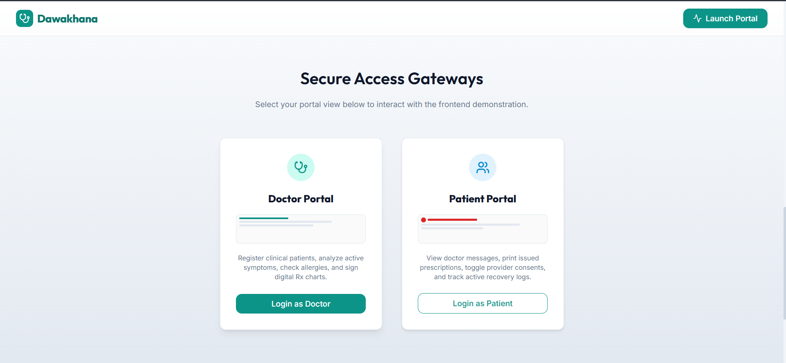

### Clinical Dashboard

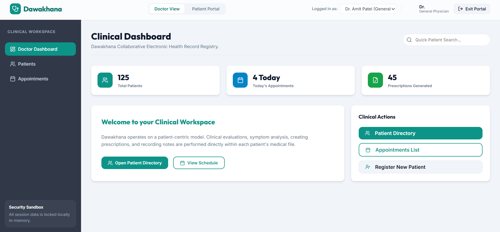

### Patient Directory

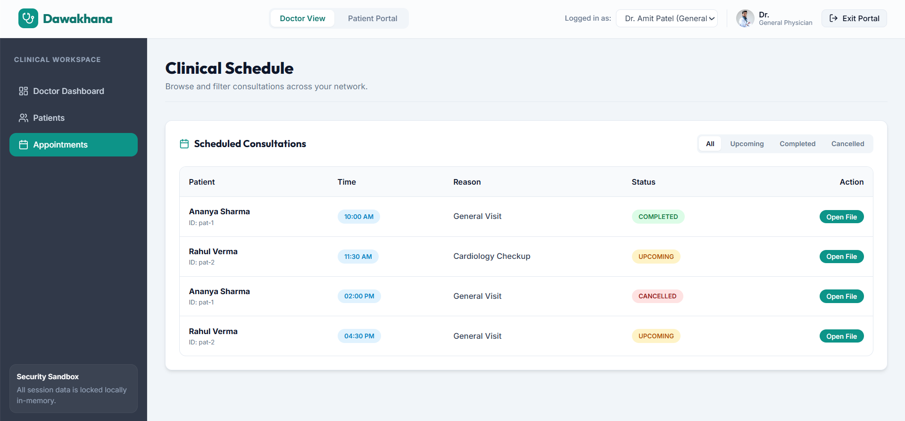

### Patient Profile

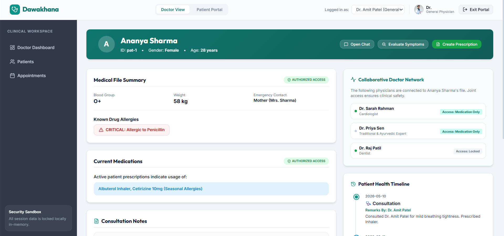

### Doctor-Patient Chat

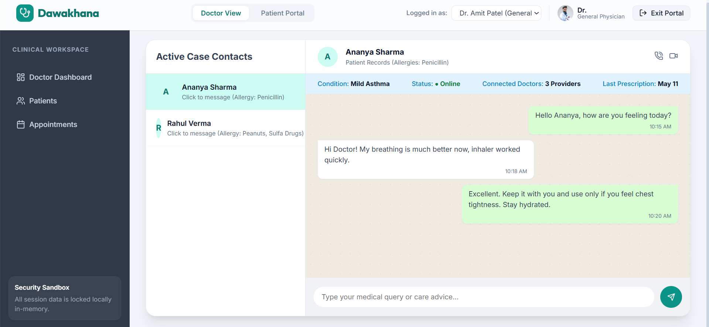

### Prescription Composer

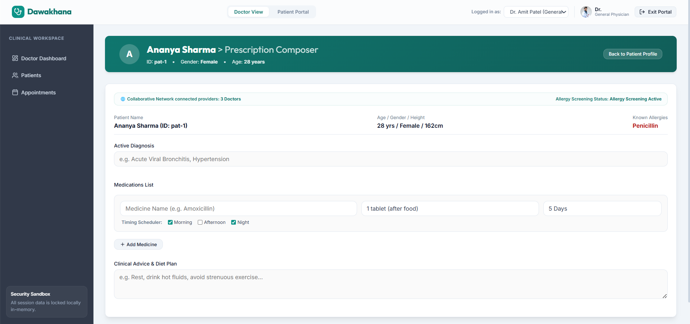

### Symptom Analyzer

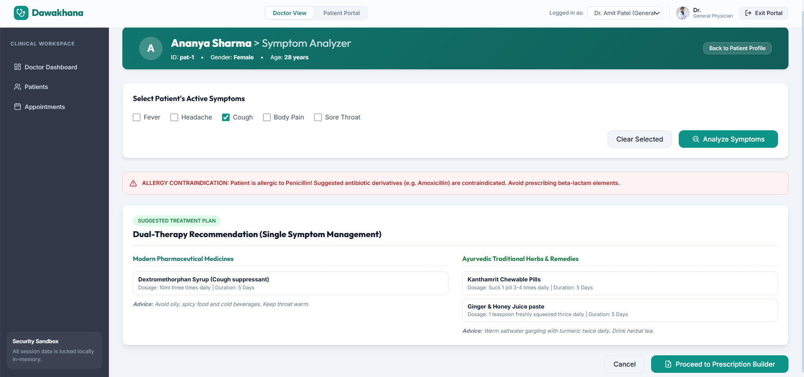

### Patient Portal

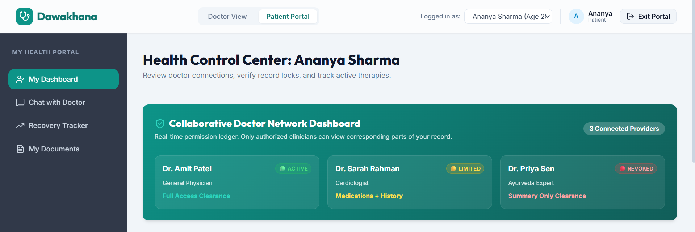

### Patient Documents

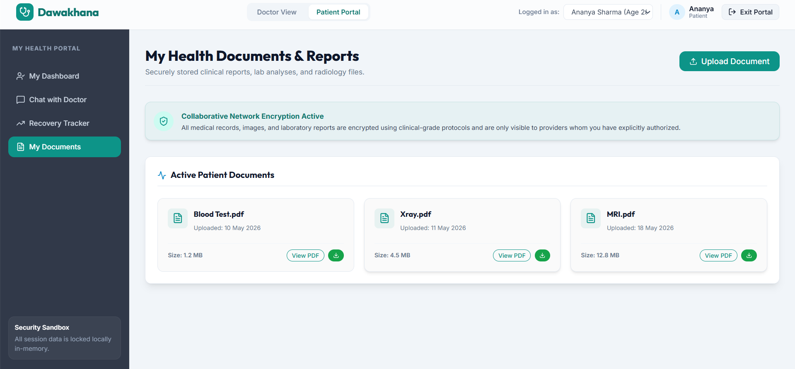

### Recovery Tracker

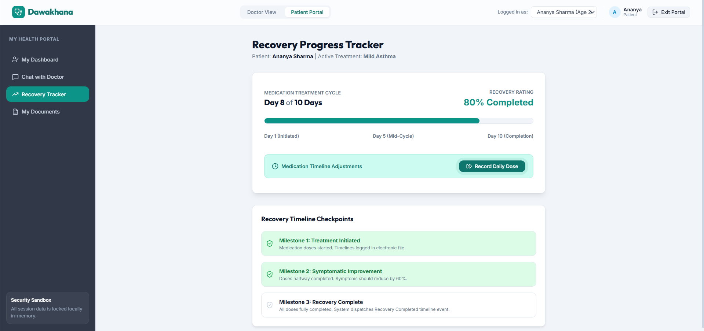

## Planned Features

* AI-assisted symptom analysis
* AI-generated treatment suggestions
* Multi-doctor collaboration workflow
* Role-based access control
* Real-time notifications
* Cloud database integration
* Medical report OCR
* Appointment reminders

## Planned Future Tech Stack

* Firebase Authentication
* Firestore Database
* Node.js
* Express.js
* OCR Integration
* AI/ML APIs
* Cloud Storage

## Author

Bhakti Sharma

GitHub: https://github.com/bhaktisharma07
